# Green Leaves [(demo)](https://greenleaves-deployed.herokuapp.com/)

## Description

Greenleaves is a business-to-business (B2B) fullstack web application enabling customers to place orders with an Asian vegetable wholesaler for pickup or delivery.

Supported languages for the product list include:

- English
- Vietnamese
- Korean
- Chinese

## Development Sprints

* [Phase 1](https://github.com/zenglenn42/glpub#user-interface)
* [Phase 2](https://github.com/zenglenn42/glpub#phase-2)


## Technology Stack

### Frontend

- React with Material Design UI
- Javascript
- HTML
- CSS

### Backend

- RESTful API (mostly)
- Javascript
- NodeJS
- ExpressJS web server
- Sequelize ORM
- MySQL
- Authentication with Auth0

# Phase 1

## User Interface

Landing Page

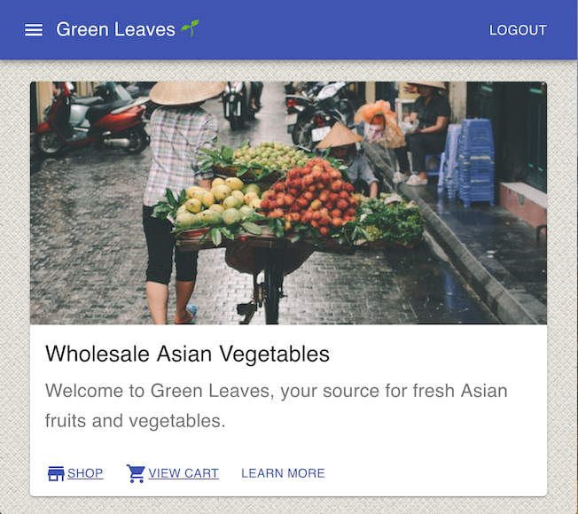

Shopping Page

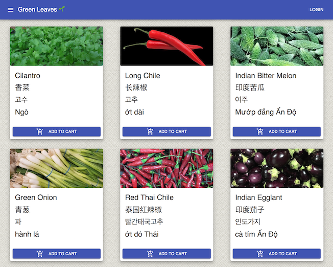

Cart Page

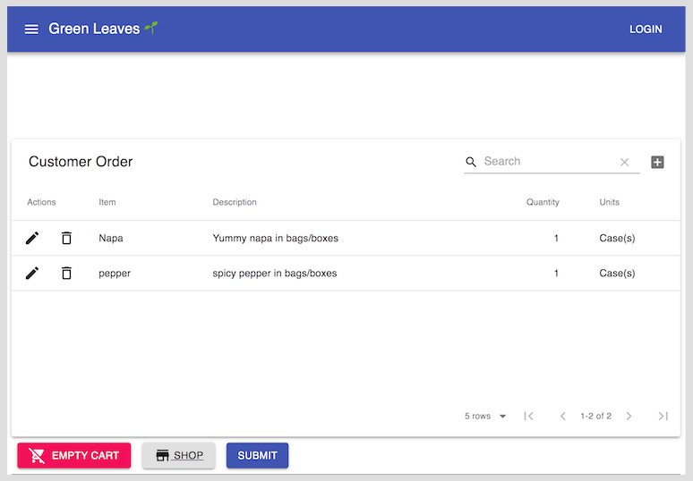

### Testing

Unit and Integration tests in Jest.

## Design

### Customer Activity Diagram

Disclaimer:

I'm abusing the UML notation a bit since the fork and join symbols imply processes that run in parallel, whereas I'm using them to describe alternate task-flows for customer and admin users. My apologies to thousand UML gods in the sky.

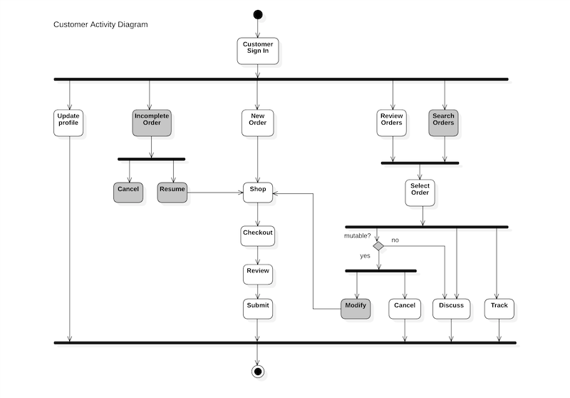

### Administrator Activity Diagram

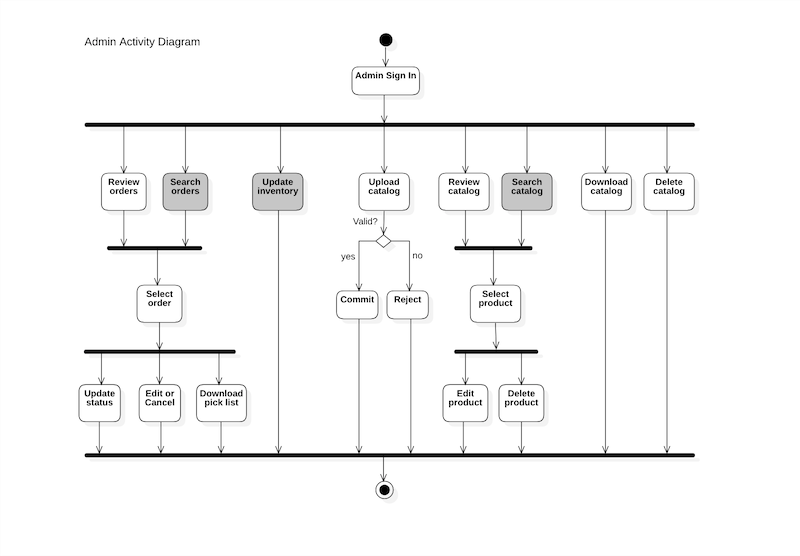

### Data Design (Entity Relationship Diagram)

## Original Concept ("recreate Amazon")


## MVP Concept


## API Server Routes

```
router.get("/orders",                  function(req, res) {...})
router.post("/order/create",           function(req, res) {...})
router.get("/orders/:user_id",         function(req, res) {...})
router.get("/orderproducts/:order_id", function(req, res) {...})

router.get("/products",                function(req, res) {...})
router.get("/products/:id",            function(req, res) {...})
router.post("/products/add",           function(req, res) {...})

router.get("/tables/drop",             function(req, res) {...})
router.get("/tables/load",             function(req, res) {...})
```

## Challenges

- Material UI & Modern React

Adopting Material UI meant embracing function-based (not class-based) React components with hooks. Significant learning curve and didn't really grapple with state and context issues until later in the development cycle.

- i18n Learning Curve

Initially we wanted to leverage i18n frameworks to fully internationalize the front-end. We burned some time exploring that but realized this was a lot to try given the timeline.
We opted to just internationalize the product catalog.

- Auth0 3 tiers (tears?) of Mastery
  - Get it working in local environment.
  - Get it working in deployed environment (with persisted state).
  - Manage user permissions / scopes and integrate with our express routes.

We got 2 out of 3 done.

- Deployment

- Heroku was black box until we discovered 'heroku logs' cli.

- Jaws DB

Hosting full product catalog (i.e., without ready workbench) required us to extend our routes and add front-end support for batch loading our data. We didn't fully realize this until late in the development cycle, burning bandwidth that could have gone to finishing the UI.

- We had some duplicate work because of miscommunication or forgetting to periodically git merge or git rebase master into our branches.

- Probably could have leveraged product board better. Didn't really get solid user stories until a week into the effort.

- Some pockets of silence during dev effort so we may have lost out on optimizing our velocity, but on balance, communication was strong.

## Successes

- Very good team engagement and self-motivation.

- Team members dug into a variety of frontend and backend tasks rather than staying in a comfort zone.

- We had great domain experts (Tue and Roy) who internationalized the product catalog.

- Backend is complete from MVP perspective.

## Future Direction

- Finish front end.
- Allow customers and admin to manage order histories.
- Add categories to product catalog so shopping experience scales nicely.
- Get better at react & react-router (and leverage context api to manage global state on frontend).

# Phase 2

We're gearing up for another 2 week sprint for Green Leaves. :-)

## Priorities

* Finish MVP from the first sprint.
    * Allow a customer to actually place an order.

* Fully implement authentication scopes and permissions (under Auth0) to control which frontend and backend routes are visible to the users.  For example, admin users should be granted a superset of access relative to customers.

* Manage product and cart state (with Redux) and local storage.

* Allow customers to review orders and order status.

* Give the admin/owner a dashboard for reviewing orders, customer, and product details.

* Leverage google translation API to internationalize the front-end.

## Here's our nominal division of labor

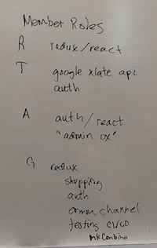

* Roy
    * react / redux 
    * cart view
    * checkout

* Tue
    * google translate api for frontend
    * auth0 collaborator

* Alec
    * auth0 lead
    * admin routes (frontend & backend)

* Glenn
    * redux state management
    * auth0 collaborator
    * requirements

## Design Kick-off (July 20, 2019)

We discuss some mobile-friendly approaches for supporting ~10 product categories on a form factor with horizontal room for only 4 to 5 items.

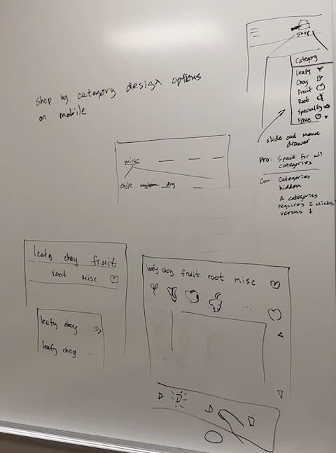

Options:

* Single line of items with ">>" or "..." to get offscreen tabs.
    * Pro: 1 line
    * Con: usability suffers for off-screen items

* Double line of options.
    * Pro: Can see all granular categories.
    * Con: Consumes some vertical space.  May look busy.

* Condense 10 granular categories into 5 'higher-level' categories that fan-out to low-level categories.
    * Pro: Visually clean at top-level.
    * Con: Maybe difficult to find secondary categories.

* Leverage a slide-out menu drawer that grants access to the vertical length of the device.
    * Pro: Can see all granualr categories at one time.
    * Con: Requires extra click to expose slide-out menu.

* Use an icon-only approach to make smaller tabs.
    * Pro: Conducive to internationalization since no translation is required.
    * Pro: Can place more tabs on horizontal space.
    * Con: If icons are not high quality, customer may be confused.
    * Con: Fat-finger mistakes by trying to cram too many icon-tabs across the screen.

We also discuss a navbar which displays a cart icon when in shop-view or a shop icon when in cart-view.
React component could simply be driven by a prop but maybe redux state comes into the picture in driving the prop?

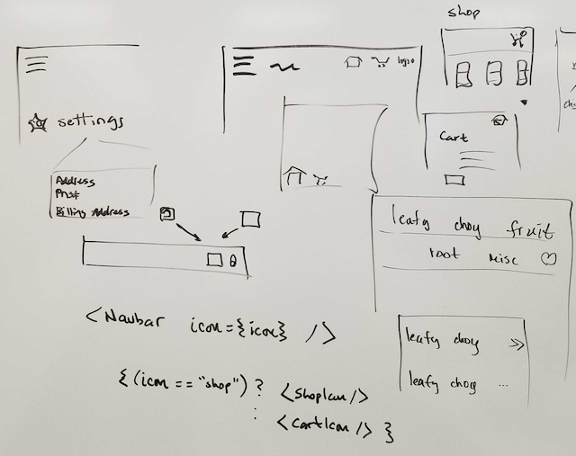

We discuss a poor man's form of inventory control that gives the admin the ability to designate 3 states to a product:

* Instock
* Limited Availability
* Out of stock

Perhaps we render limited availability items to 'preferred' customers who are high-volume and consistently pay on time.
This implies that we require a customer to authenticate when they start adding items to cart.

Ideally, inventory control would be tied to some backend database that gets updated in real-time as product arrives, is sold, perishes, or disappears.

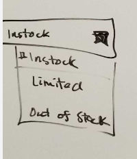

We briefly discuss the importance of not camping out in a branch too long.  Otherwise, you may have merge issues if the master branch has evolved significantly relative to when you first create the branch.

One strategy for long-lived branches is to periodically 'git rebase master':

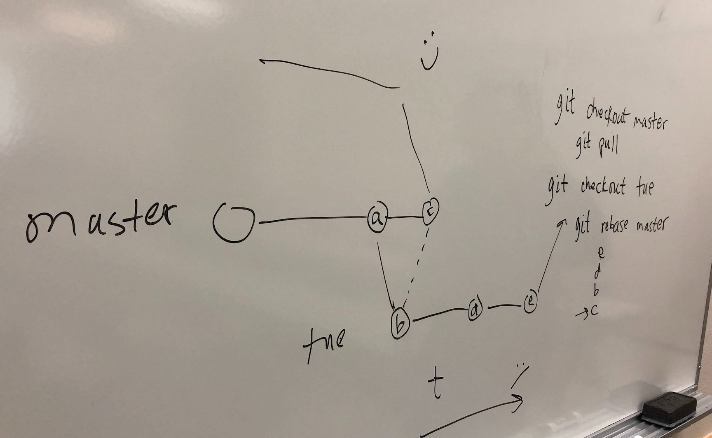

## Wireframes

### Landing Page

With phase 2, we envision adding some seasonal interest (blog-like) content.


### Shopping by Category

For this phase, we're adding the ability to shop by category.  This improves the user experience for large product catalogs.


### Cart Page

Customers will be able to view all the products they have selected as well as modify their orders by deleting or adjusting the quantity of items. They will also be asked to designate their pickup or delivery preference.


### Checkout (for pickup or delivery)

Once customers are satisfied with the contents of their shopping cart, they designate their pickup or delivery preference and proceed to one of these checkout flows:

Delivery


Pickup


Confirmation


### Admin Dashboard

Review orders.


Review products.


Review customers.


Aspirationally, it would be cool to add analytics around product and customers sales history.

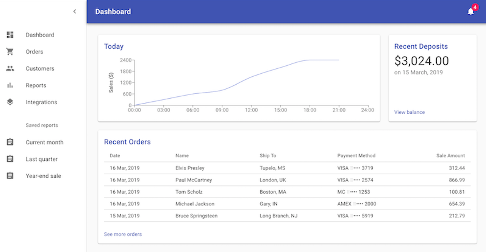
